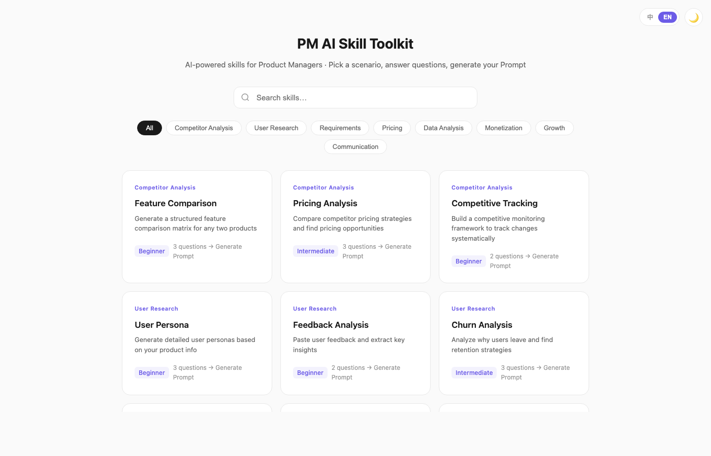

<p align="center">
  
</p>

<p align="center">
  <strong>PM AI Skill Toolkit</strong><br>
  The operating system for AI-native product managers
</p>

<p align="center">
  Guided toolkit for humans · Structured skills for agents · Opinionated PM workflows
</p>

<p align="center">
  <a href="https://lujuncheng1225-cloud.github.io/AI_Commercialization--Product-Management-skills/pm-skills-interactive-course.html">Try the Toolkit</a>
  ·
  <a href="MANIFESTO.md">Manifesto</a>
  ·
  <a href="START_HERE.md">Start Here</a>
  ·
  <a href="README.zh-CN.md">中文</a>
</p>

---

Most AI-for-PM resources help people write faster.

This repo is built to help product managers think better, structure work better, and make stronger decisions with AI.

It combines three layers in one system:

- `Try`: a guided PM toolkit for immediate use
- `Learn`: reusable PM reasoning, workflows, and examples
- `System`: portable skills, commands, routing rules, and evals for agents

If you want a pile of prompts, this repo is overbuilt.
If you want a reusable PM operating system, this repo is for you.

## Why This Exists

The biggest barrier for PMs using AI is rarely "prompt syntax".
It is usually one of these:

- they do not know what to ask
- they skip clarification and jump into output
- they generate artifacts without judgment
- they produce polished answers without decision discipline

This library is designed to fix that by encoding not just prompts, but:

- routing rules
- output standards
- review gates
- evaluation discipline
- commercialization and growth judgment

## Three Ways To Use It

### 1. Try

Use the interactive toolkit if you want a fast starting point for real PM tasks.

- [Live Demo](https://lujuncheng1225-cloud.github.io/AI_Commercialization--Product-Management-skills/pm-skills-interactive-course.html)
- 20 guided PM scenarios
- bilingual UI
- mobile-friendly and copy-ready output

Best for:

- competitor analysis
- PRD drafting
- pricing strategy
- growth experiments
- PM communication

### 2. Learn

Use the repo as a PM learning and reasoning library if you want to improve how you work with AI.

- [MANIFESTO.md](MANIFESTO.md)
- [START_HERE.md](START_HERE.md)
- [agent/ROUTING.md](agent/ROUTING.md)
- [agent/OUTPUT_STANDARDS.md](agent/OUTPUT_STANDARDS.md)

Best for:

- learning how strong AI-native PM work should be structured
- understanding when to clarify, diagnose, decide, and document
- building a more opinionated PM practice

### 3. System

Use the repo as a portable PM agent brain if you want reusable workflows across tools and models.

- `skills/` for single capabilities
- `commands/` for orchestrated PM workflows
- `agent/` for cross-platform policy
- `adapters/` for Codex / Claude Code / Cursor setup
- `evals/` for quality baselines
- `private/` for optional personal context

Best for:

- AI PM copilots
- internal PM agents
- reusable team workflows
- cross-model prompt and output consistency

## What Makes This Different

Most PM AI repos optimize for breadth.
This one tries to optimize for professional reliability.

- `Decision before decoration`
- `Evidence before confidence`
- `Structure before style`
- `Actionability before completeness`

In practice, that means this repo emphasizes:

- explicit routing between commands and skills
- structured clarification before output
- documented decision outputs
- assumptions / risks / next steps as defaults
- commercialization depth, not just generic product advice
- evals and validation, not just content volume

## What's Inside

- `docs/pm-skills-interactive-course.html` — interactive PM toolkit
- `skills/` — 22 PM skill files usable by humans and agents
- `commands/` — 10 multi-skill workflows
- `agent/` — routing, output standards, sparse-context policy
- `adapters/` — tool-specific setup for Codex, Claude Code, Cursor
- `evals/` — routing and output quality baselines
- `catalog/` — generated indexes
- `scripts/` — validation and catalog tooling
- `private/` — optional personalization templates

## Quick Paths

If you want the fastest path, start here:

- Write a PRD: [commands/write-prd.md](commands/write-prd.md)
- Shape an AI feature: [commands/shape-ai-feature.md](commands/shape-ai-feature.md)
- Review commercialization strategy: [commands/commercial-strategy-review.md](commands/commercial-strategy-review.md)
- Diagnose funnel drops: [commands/commercial-growth-review.md](commands/commercial-growth-review.md)
- Build with Codex: [adapters/CODEX.md](adapters/CODEX.md)

## Local Run

```bash
git clone https://github.com/lujuncheng1225-cloud/AI_Commercialization--Product-Management-skills.git
cd AI_Commercialization--Product-Management-skills/docs
python3 -m http.server 8888
# Open http://localhost:8888/pm-skills-interactive-course.html
```

## Validation

```bash
python3 scripts/validate-library.py
python3 scripts/check-style-consistency.py
python3 scripts/generate-catalog.py
```

## License

MIT
