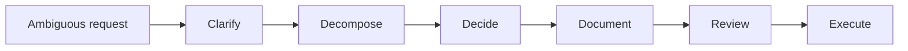

# Method Map

This is a simplified public-facing diagram for the system.

If you want a fast way to explain the toolkit in GitHub, docs, or a post, use the diagram below.

## What This Diagram Is Saying

- strong PM + AI workflows should not start with generation
- stable systems clarify, decompose, and decide before they document
- documents are containers for judgment, not the endpoint
- review gates are what make the system more dependable over time

## One-Line Explanation

**PM AI Skill Toolkit is not a prompt library. It is a PM decision chain from clarification to execution.**

## Short Caption

> I care less about how AI helps PMs write more, and more about how AI helps PMs work more reliably.
