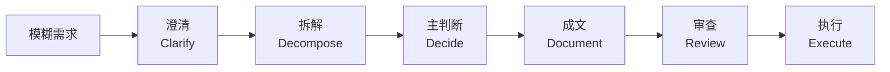

# 方法图

这是一张适合对外传播的简化方法图。

如果你想在 GitHub、文档或分享里快速解释这套系统，可以直接使用下面这张图。

## 这张图想表达什么

- 好的 PM + AI 工作流，不该从“生成”开始
- 真正稳定的系统，先澄清，再拆解，再下判断
- 文档只是中间产物，不是终点
- review gate 决定这套系统能不能长期被信任

## 一句话解释

**PM AI Skill Toolkit 不是一个提示词库，而是一条从澄清到执行的 PM 判断链路。**

## 对外短文案

可以直接配这张图使用：

> 我更关心的不是怎么让 AI 帮 PM 写更多，而是怎么让 AI 帮 PM 把判断和工作流做得更稳。
